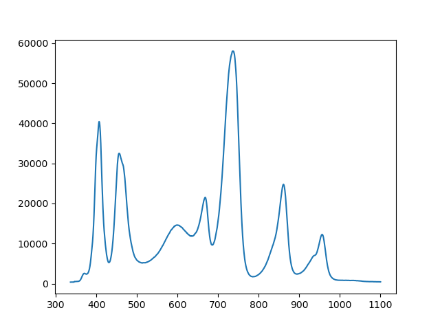
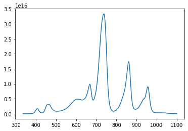

# pyAvantes

This python package allows you to view and parse Avantes raw8 spectra.

## Installation

This Python library can be installed by cloning this repository and then running the `setup.py` file with the `install` option:
```bash
python setup.py install 
```v
This package requires `setuptools`. 

## Example

Once it is loaded as a Raw8 object, the raw spectrum data is stored
under the `scope` attribute, and the accompanying wavelength data is stored
under the `wavelength` attribute.

```python
import pathlib
from pprint import pprint

import matplotlib.pyplot as plt
import pyAvantes

package_path = pathlib.Path(pyAvantes.__path__[0])
example_path = package_path.parent / "doc/example.Raw8"
spectrum = pyAvantes.Raw8(example_path)

fig, ax = plt.subplots()
ax.plot(spectrum.wavelength, spectrum.scope)
plt.show()
```



If you have a reference blackbody source and a dark dataset in your file to
compare against, you can compute the relative irradiance as calculated from
the [Avasoft manual][avasoft].

```math
S_\lambda = B_\lambda * (\textrm{sample}_\lambda - \textrm{dark}_\lambda )
```

The results of this calculation are presented as a `relative_irradiance`
attribute.

[avasoft]: http://www.content.mphotonics.de/AVA/AVASOFT_Manual_8.4.pdf

```python
fig, ax = plt.subplots()
ax.plot(spectrum.wavelength, spectrum.relative_irradiance)
plt.show()
```



You can view the header contents with a simple attribute access.

```python
pprint(spectrum.header)
```

```
{'Avg': 5,
 'Boxcar': 1,
 'CalIntTime': 51.54999923706055,
 'ColorTemp': 2850.0,
 'IntTime': 23.329999923706055,
 'NTC2volt': 0.0,
 'SDmarker': 0,
 'SPCfiledate': 2120633355,
 'TrigMode': 0,
 'TrigSource': 0,
 'TrigSourceType': 0,
 'bitness': 0,
 'boardTemp': 35.5,
 'comment': '',
 'detectorTemp': 0.0,
 'enable': 1,
 'fitdata': (335.76513671875,
             0.599160432815552,
             -1.51733911479823e-05,
             -2.37885777742974e-09,
             0.0),
 'forgetPercentage': 100,
 'integrationdelay': 0,
 'laserDelay': 0,
 'laserWavelength': 0.0,
 'laserWidth': 0,
 'length': 25397,
 'measMode': 0,
 'numSpectra': 1,
 'saturationdetection': 1,
 'seqNum': 0,
 'smoothmodel': 0,
 'specID': '2108422U1',
 'startPixel': 0,
 'status': 2,
 'stopPixel': 1330,
 'store2ram': 0,
 'strobeCtrl': 0,
 'timestamp': 383032154,
 'userfriendlyname': '2108422U1',
 'version': 'AVS84'}
```

For convenience, many of the header dictionary items can be accessed directly by attribute access using snake_case names. For instance, the `CalIntTime` can be accessed outside of the header with the following syntax:

```python
print(spectrum.calibration_integration_time)
```

```
51.54999923706055
```

The dot notation allows auto-completion engines to infer the attribute by
partial match, so those who use such tools can guess any provided camelCase
header name as a snake_case equivalent name and let the auto-completion
engine complete the attribute name.

The acquisition date can be extracted as a dictionary or as a standard ISO
8601 string.

```python
print(spectrum.date)
print(spectrum.datetime)
```

```
{'year': 2022, 'month': 6, 'day': 9, 'hour': 16, 'minute': 11}
2022-06-09 16:11:00
```
